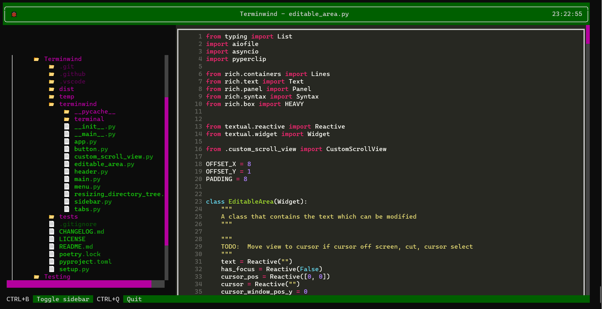

# Terminwind

**Note: Project on hiatus until my exams are over**

This project was made using [Textual](https://github.com/Textualize/textual).

Install with `pip install terminwind`. Run with `python -m terminwind (path to open)`. If no path is specified, the path will be selected as the one two times higher than the one you are running the command from.

Project works with Python 3.7 or above.

TODO:
- Make screen jump to cursor when typing if cursor is off screen.
- Cut
- Removing large amounts of selected text
- Undo and redo
- Create new files and directories
- Have multiple files open at once
- Improve performance
- Fix tab wonkiness

